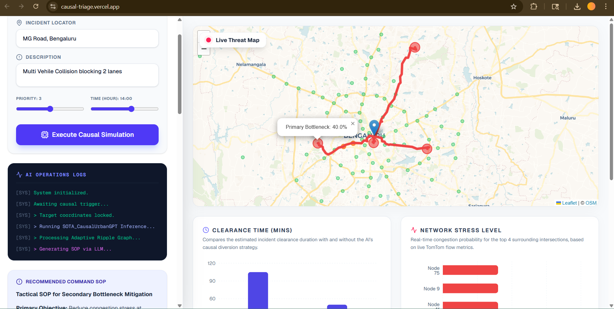

# 🚔 TriadCausal-Command
> **AI-Driven Event Congestion Forecasting & Tactical Mitigation**  
> *Developed by Team Uragirimono (Lead: Ankit Ghosh)*



---

## 🚦 The Problem: Event-Driven Congestion
Whether it's a political rally, a cultural festival, a sports event, or an unexpected accident, sudden gatherings create massive, localized traffic breakdowns.

**Why is this hard to manage today?**
- **Reactive, Not Proactive:** Police typically respond to traffic jams *after* they happen.
- **Guesswork Deployment:** Deciding how many officers to send and which roads to block is based purely on human experience rather than mathematical data.
- **No Post-Event Learning:** There is no system to analyze if the police intervention actually worked.

---

## 🔮 Our Solution: The Tactical Command Dashboard
**TriadCausal-Command** is an intelligent, predictive command center designed for modern urban authorities. 

Instead of waiting for gridlock to happen, our system uses **Causal AI** to predict exactly where the traffic shockwave will spread, allowing authorities to deploy resources *before* the roads freeze.

### Core Capabilities:
1. ⏱️ **Instant Prediction:** Enter an event (e.g., "Protest at Town Hall"), and the AI instantly calculates exactly *where* the traffic will spill over and *how long* it will take to clear.
2. 🗺️ **Proactive Vision:** Authorities can visualize future bottlenecks as red radiating paths on a live map *before* the gridlock actually hits.
3. 🤖 **Automated Strategy (SOP):** The dashboard generates a step-by-step tactical plan, telling commanders exactly how many officers to dispatch and which roads to barricade to clear the jam faster.

---

## 🧠 Why Causal AI? (Our Secret Weapon)
Standard Machine Learning models (like Random Forests) only learn *correlations* (e.g., "if it rains, traffic slows down"). They don't understand *how* traffic spreads.

We built a **Spatial-Temporal Graph Neural Network (STGNN)** that learns pure **Causality**.
- **Topological Discovery:** It mathematically discovers the hidden "ripple effects" between road intersections without even needing a hardcoded city map.
- **"What-If" Interventions:** We can simulate the future! By testing different police deployment strategies in the software, the AI calculates exactly how much time you will save before you even send a single officer.

---

## 💻 Tech Stack
- **AI/ML Core:** PyTorch, Hugging Face Transformers (BERT)
- **Generative AI:** Groq Cloud (LLaMA-3 8B) for high-speed SOP generation
- **Mapping & Live Traffic:** MapmyIndia (Mappls) Routing & Geocoding APIs
- **Backend:** Python FastAPI
- **Frontend:** Next.js, React, TailwindCSS, Recharts, Leaflet

---

## 🚀 Getting Started (Local Setup)

### 1. Configure API Keys
Navigate to the `backend/` folder and open the `.env` file (create it if it doesn't exist). Add your keys:
```env
MAPMYINDIA_REST_KEY=your_mappls_key_here
GROQ_API_KEY=your_groq_key_here
```
*(Ensure `sota_urban_causal_weights.pth` is present in the `backend/` folder).*

### 2. Start the Backend (FastAPI + AI Model)
```bash
cd backend
pip install -r requirements.txt
uvicorn main:app --reload
```

### 3. Start the Frontend (Next.js Dashboard)
Open a new terminal window:
```bash
cd frontend
npm install
npm run dev
```

### 4. Run a Simulation!
Open your browser to `http://localhost:3000`. 
Type an event location and description, hit **Execute Causal Simulation**, and watch the AI instantly forecast the shockwaves and generate your tactical action plan!
